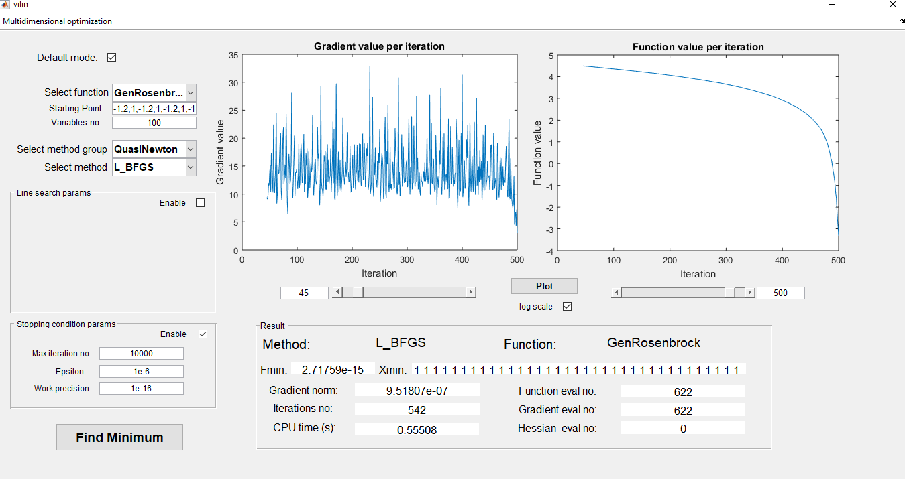
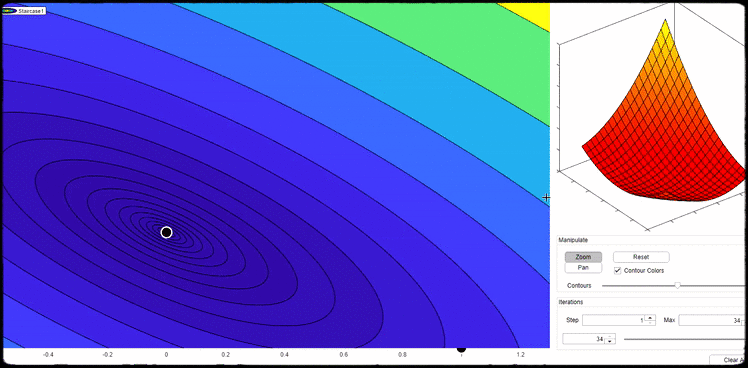
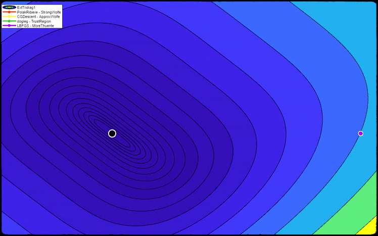

 # Vilin
#### Matlab GUI application for Numerical optimization

Vilin is a GUI framework for executing and testing different unconstrained optimization algorithms
in programming package Matlab. The application contains a library of various test functions with 
pre-defined starting points. A several known classes of methods as well as different classes of 
line search procedures are covered. Each method can be combined with variety of appropriate line 
search procedures and tested on each test function with a chosen number of parameters. Vilin is 
easily extensible and contains simple API for adding new functions, methods and line searches. 
The application is tested and can be run on both windows and linux operating system.

To run the application just execute vilin.m.

### Methods
* Methods are divided in six groups based on their nature and characteristics. Currently implemented methods:
    * Conjugate Gradient
		* CG_Descent
        * Dai-Yuan
        * Fletcher-Reeves
        * Hestenes-Stiefel
        * Polak-Ribiere
    * Gradient Descent
        * Barzilai-Borwein
        * GradientLineSearch - classical gradient descent with line search
        * ScalarCorrection
    * Modified Newton
        * Goldstein-Price
        * Levenberg
        * Levenberg-Marquardt
    * Newton
        * NewtonLineSearch - basic Newton's method with line search
    * Quasi Newton
        * BFGS
        * DFP
        * L_BFGS
        * SR1
	* Trust Region
		* dogleg
		* doglegSR1

* Currently implemented line search methods
	* Approximate Wolfe
    * Armijo (two versions, with interpolation and backtracking)
	* CorrPrevIter
	* CorrPrevTwoIter
	* FixedStepSize
    * Goldstein
    * More-Thuente
    * Non-monotone
    * StrongWolfe
    * Wolfe
	
### Graphical illustrations

* Graphical representation of the convergence of the chosen method 

	Vilin application provides the ability of graphical representation of the chosen method convergence.
	Namely, the user can follow the process of approaching the function minimum for the chosen method in 2d and 3d spaces.
	Several interesting features can be used: zoom in, zoom out, slider
	for reaching the minimum or going back to starting point etc.

		Graphical illustration of the convergence of the gradient descent method.

* Comparison of several different methods on a same test function 
	

	
### Adding new methods
Methods are located in folder [Methods/MultiDimensional](Methods/MultiDimensional/). Each method group has separate subfolder.
To add new method modify [Methods template](Methods/MultiDimensional/NewMethodTemplate.m) and save to appropriate group folder (or create new).

### Adding new line search methods
Line search methods are located in folder [Methods/MultiDimensional/LineSearch](Methods/MultiDimensional/LineSearch).
To add new line search method modify [Line search template](Methods/MultiDimensional/NewLineSearchTemplate.m) and save to [Methods/MultiDimensional/LineSearch](Methods/MultiDimensional/LineSearch) folder.

### Adding new functions
Functions are located in folder [Functions/MultiDimensional](Functions/MultiDimensional/).
To add new function modify [Functions template](Functions/NewFunctionTemplate.m) and save to [Functions/MultiDimensional](Functions/MultiDimensional/) folder.

### Interested implementation 
Very interesting and nicely optimized C++ implementation (made by my students) of the methods from 
Vilin can be found on https://github.com/lazarst96/NumericalOptimisation.

